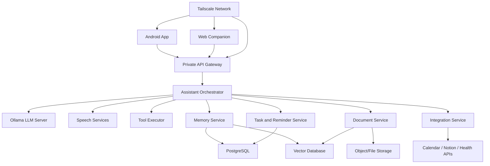
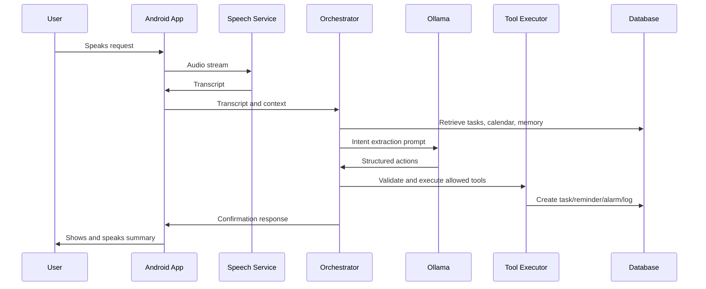

# Local LLM Personal Assistant - Solution Design

## 1. Vision

Build a fully local, privacy-first personal assistant powered by Ollama-hosted LLMs. The assistant should feel less like a chatbot and more like a caring daily companion: it listens, remembers, plans, nudges, reminds, and adapts to the user's lifestyle over time.

The assistant will be served from a private Docker-based home server and accessed securely over a private Tailscale network. The Android app will be the primary interface, with a UX-first design focused on fast voice capture, calm daily planning, reminders, alarms, habit tracking, and personal coaching. A companion web app will support document-heavy workflows and file-based tasks.

## 2. Product Goals

- Provide a fully local assistant that works without exposing private data to cloud LLM providers.
- Make voice the fastest way to capture intent, tasks, plans, reminders, and personal logs.
- Help the user build better routines through gentle, context-aware reminders.
- Learn from user behavior over time while keeping memory transparent and editable.
- Coordinate tasks, calendars, alarms, sleep, water intake, nutrition, goals, documents, and planning tools.
- Support Android-first everyday use, with web as a companion surface for deeper document and file workflows.
- Run reliably on a private network using Docker and Tailscale.

## 3. Non-Goals for Initial Release

- Replacing professional medical, nutrition, or mental health advice.
- Exposing the assistant publicly on the internet.
- Building a general multi-user SaaS platform.
- Depending on cloud LLM inference for core functionality.
- Fully autonomous actions without user-configurable safety limits.

## 4. Target Users

Primary user:

- A single individual who wants a private, local AI assistant to manage daily life.
- Uses an Android phone as the main device.
- Wants voice-first capture and reminders.
- Wants help with routines, sleep, hydration, nutrition, tasks, and personal goals.
- May use Google Calendar, Google Health Connect, Notion, or similar planning tools.

Future users:

- Household members on the same private Tailscale network.
- Users with multiple devices and wearable health data sources.

## 5. Core Experience

The assistant should behave like a responsible caregiver: attentive, persistent, context-aware, and kind without becoming annoying.

Example daily flow:

1. The user wakes up after an alarm chosen based on sleep data and today's schedule.
2. The assistant summarizes the day: calendar events, high-priority tasks, health reminders, weather if available, and suggested focus blocks.
3. The user says, "Remind me to call the electrician after lunch and add buying oats to my grocery list."
4. The assistant extracts the actions, confirms them briefly, and adds the task and shopping item.
5. Throughout the day, the assistant nudges the user to drink water, enter meals, start important tasks, and wind down before sleep.
6. At night, it reviews unfinished tasks, adjusts priorities, and plans the next day.

## 6. Key Use Cases

### Voice Capture

- Add tasks to a to-do list.
- Set reminders and alarms.
- Log meals, water intake, mood, energy, exercise, and sleep notes.
- Ask for the day's plan.
- Ask the assistant to reprioritize work.
- Create calendar events.
- Create or update Notion pages or planning documents.

Example utterances:

- "Add a task to submit the insurance form tomorrow morning."
- "Wake me up early if I sleep before 11."
- "Remind me to drink water every hour until 8 PM."
- "I ate rice, dal, and curd for lunch."
- "Plan my evening around finishing the report and going for a walk."

### Automatic Prioritization

The assistant should rank tasks using:

- Due date and time sensitivity.
- User-stated importance.
- Calendar constraints.
- Estimated effort.
- Goal alignment.
- Historical completion behavior.
- Energy level and sleep quality.
- Recurrence and habit importance.

Priority output should be explainable:

- "High priority because it is due today and blocks tomorrow's meeting."
- "Moved to evening because your afternoon is already full."

### Reminders and Alarms

- One-time reminders.
- Recurring reminders.
- Smart reminders based on time windows.
- Escalating reminders for important tasks.
- Wake-up alarms based on sleep cycle, calendar, and morning preparation time.
- Hydration reminders.
- Nutrition logging prompts.
- Wind-down reminders.

### Daily Planning

- Morning plan.
- Midday check-in.
- Evening review.
- Weekly review.
- Goal progress summary.
- Suggested task ordering.
- Schedule conflict detection.

### Documents and Files

The web companion should support:

- Uploading documents.
- Summarizing documents.
- Extracting tasks from files.
- Asking questions over documents.
- Comparing versions.
- Generating drafts.
- Creating task plans from PDFs, DOCX, spreadsheets, notes, or images.

### Health and Lifestyle

Potential integrations:

- Android Health Connect.
- Google Fit or Google Health data where available.
- Sleep data from phone or wearable.
- Step count.
- Exercise sessions.
- Water intake.
- Nutrition logs.
- Weight trends.

The assistant uses health data to improve planning:

- Avoid aggressive morning schedules after poor sleep.
- Suggest earlier wind-down after repeated late nights.
- Adjust wake-up alarms based on sleep duration and calendar requirements.
- Remind the user to hydrate after exercise.
- Ask for meal logs at regular intervals.

## 7. UX Principles

### Android App

The Android app is the main product. It should be fast, calm, and useful with one hand.

Principles:

- Voice-first, but never voice-only.
- One-tap capture from the home screen.
- Minimal friction for adding tasks, reminders, meals, and water.
- Clear confirmation after assistant actions.
- Never bury urgent tasks behind chat history.
- Use cards for actionable items, not decorative content.
- Let the user correct assistant memory and decisions.
- Make privacy and local processing visible.
- Support offline or degraded local-network modes gracefully.

Primary Android screens:

- Today
- Voice Capture
- Tasks
- Reminders and Alarms
- Health Logs
- Goals
- Assistant Chat
- Memory
- Settings

### Today Screen

The Today screen is the home base.

Content:

- Current status: time, next event, next reminder.
- Top 3 priorities.
- Today's timeline.
- Hydration and nutrition check-ins.
- Sleep and energy summary.
- Quick actions: Speak, Add task, Add water, Log meal, Set reminder.
- Assistant suggestion: one calm next step.

### Voice Capture UX

Voice capture should be immediate:

1. Tap microphone or use Android quick tile/widget.
2. Speak naturally.
3. See live transcription.
4. Assistant extracts intended actions.
5. User sees a compact confirmation:
   - "Added task: Call electrician, today after lunch."
   - "Added grocery item: oats."
6. For risky or ambiguous actions, ask a short clarification.

### Reminder UX

Reminder notifications should be actionable:

- Done
- Snooze
- Reschedule
- Explain
- Open related task

Escalation should be configurable:

- Gentle
- Standard
- Persistent for critical tasks

### Memory UX

Users must be able to inspect and edit memory.

Memory categories:

- Preferences
- Routines
- Goals
- Health patterns
- Task patterns
- People and relationships
- Important personal context
- Assistant rules

Each memory should show:

- What the assistant remembers.
- Where it came from.
- Last updated date.
- Whether it can be used for planning.
- Delete or edit controls.

## 8. Web Companion

The web app is secondary to Android but important for document and file workflows.

Primary web features:

- Document upload and library.
- Chat with selected documents.
- Task extraction from files.
- Planning workspace.
- Calendar/task timeline.
- Memory management.
- Integration settings.
- Long-form assistant responses.

The web app should be served from the same private Docker stack and accessed over Tailscale.

## 9. System Architecture

### Main Components

#### Android App

Responsibilities:

- Voice input.
- Notification delivery.
- Alarm scheduling.
- Health Connect access.
- Fast task and reminder entry.
- Daily plan UI.
- Local cache for offline resilience.

Suggested stack:

- Kotlin.
- Jetpack Compose.
- Android Health Connect APIs.
- Android AlarmManager or exact alarm APIs where allowed.
- WorkManager for background sync.
- Tailscale Android app or embedded/private network access strategy.

#### Web App

Responsibilities:

- Document workflows.
- File upload and management.
- Long-form assistant interactions.
- Memory and integration administration.

Suggested stack:

- React or Next.js.
- Tailwind or existing design system.
- WebSocket or server-sent events for streaming responses.

#### API Gateway

Responsibilities:

- Authenticate private-network clients.
- Rate limit local services.
- Route requests to assistant modules.
- Provide REST and streaming endpoints.

Suggested stack:

- FastAPI, NestJS, or Go.
- JWT or device-bound tokens.
- Optional mTLS inside Tailscale for stronger trust.

#### Assistant Orchestrator

Responsibilities:

- Receive user input.
- Classify intent.
- Retrieve relevant memory and documents.
- Build prompts.
- Call Ollama.
- Decide when to use tools.
- Validate structured outputs.
- Ask clarifying questions when needed.
- Store new memory after user consent or configured rules.

#### Ollama LLM Server

Responsibilities:

- Local model hosting.
- Chat completion.
- Tool planning and reasoning.
- Summarization.
- Document Q&A.

Candidate local models:

- Llama 3.1 or newer local instruct models.
- Qwen instruct models.
- Mistral/Nemo-style instruct models.
- Smaller models for classification and extraction.

Model choice depends on available hardware. The system should support model profiles:

- Fast mode for task extraction.
- Balanced mode for daily planning.
- Deep mode for documents and reflection.

#### Speech Services

Responsibilities:

- Speech-to-text.
- Optional text-to-speech.
- Wake phrase support if feasible.

Candidate local tools:

- Whisper.cpp.
- faster-whisper.
- Vosk for lightweight offline recognition.
- Piper or Coqui-style local TTS.

#### Tool Executor

Responsibilities:

- Execute approved actions.
- Add tasks.
- Create reminders.
- Set alarms.
- Update calendar.
- Update Notion.
- Log water or nutrition.
- Query documents.

Tool execution must use structured schemas and permission checks.

#### Memory Service

Responsibilities:

- Store long-term user memory.
- Store episodic summaries.
- Store preferences and routines.
- Retrieve context for planning.
- Support memory review and deletion.

Memory should be split into:

- Profile memory: stable user preferences and facts.
- Routine memory: recurring behavior and schedule patterns.
- Goal memory: stated goals and progress.
- Episodic memory: summarized past interactions.
- Semantic memory: embedded document/task/context snippets.

#### Task and Reminder Service

Responsibilities:

- Store tasks, reminders, alarms, habits, and goals.
- Manage recurrence.
- Calculate priorities.
- Trigger notifications.
- Sync with Android.
- Support calendar-aware scheduling.

#### Document Service

Responsibilities:

- Ingest files.
- Extract text.
- Chunk and embed content.
- Store metadata.
- Provide retrieval for document Q&A.
- Extract tasks or decisions from files.

#### Integration Service

Responsibilities:

- Calendar sync.
- Notion sync.
- Health Connect ingestion through Android.
- Optional Google APIs where user grants access.
- Webhook support for future tools.

## 10. Deployment Architecture

The assistant should run as a Docker Compose stack on a trusted local machine.

Core containers:

- `api`: backend API and gateway.
- `orchestrator`: assistant reasoning and tool workflow service.
- `ollama`: local LLM runtime.
- `speech`: speech-to-text and text-to-speech service.
- `postgres`: relational database.
- `vector-db`: Qdrant, Chroma, or pgvector.
- `redis`: queues, short-lived state, scheduling support.
- `worker`: background jobs.
- `web`: companion web app.
- `file-store`: local mounted storage or MinIO.

Network access:

- Services are bound to the private Docker network.
- Public internet exposure is disabled by default.
- Android and web clients connect using Tailscale private DNS or MagicDNS.
- Admin endpoints are accessible only over Tailscale.

## 11. Data Model

Core entities:

- User
- Device
- Conversation
- Message
- Task
- Reminder
- Alarm
- Habit
- Goal
- CalendarEvent
- HealthMetric
- NutritionLog
- WaterLog
- MemoryItem
- Document
- DocumentChunk
- IntegrationAccount
- AssistantAction
- AuditLog

Important fields:

- `source`: voice, chat, document, integration, manual.
- `confidence`: assistant confidence in extracted data.
- `status`: pending, active, done, skipped, archived.
- `priority_score`: computed task priority.
- `requires_confirmation`: whether action needs user approval.
- `privacy_scope`: local-only, syncable, sensitive.

## 12. Assistant Workflow

### Voice-to-Action Flow

### Daily Planning Flow

1. Gather today's calendar events.
2. Gather open tasks and deadlines.
3. Gather sleep, energy, and health signals.
4. Retrieve active goals and routines.
5. Calculate priority scores.
6. Ask LLM to create a human-friendly daily plan using structured constraints.
7. Save the plan.
8. Schedule reminders and alarms.
9. Send morning summary to Android.

## 13. Prioritization Logic

Priority should be partly deterministic and partly LLM-assisted.

Deterministic score inputs:

- Due date proximity.
- Explicit importance.
- Estimated duration.
- Calendar availability.
- Goal relevance.
- Dependencies.
- Missed reminder count.
- User energy and sleep quality.

LLM role:

- Explain priority decisions.
- Detect implicit importance.
- Suggest task grouping.
- Recommend realistic scheduling.
- Identify conflicts and overload.

The final priority score should be stored and auditable.

## 14. Memory and Personalization

The assistant should learn gradually.

Examples of useful memories:

- "The user prefers morning workouts when sleep quality is good."
- "The user often skips lunch reminders during meetings."
- "The user wants persistent reminders for medication."
- "The user is trying to reduce late-night screen time."
- "The user prefers concise confirmations."

Memory creation policy:

- Low-risk routine observations can be suggested automatically.
- Sensitive health or personal facts should require confirmation.
- The user can delete or edit any memory.
- Memories should decay or be revalidated if stale.

Memory safety:

- Do not infer sensitive conclusions aggressively.
- Keep health recommendations conservative.
- Use assistant language like "suggest" instead of "diagnose."
- Make important automation rules visible.

## 15. Privacy and Security

Privacy is a core feature.

Security requirements:

- Local-first storage.
- No public API exposure.
- Tailscale-only access.
- Device authentication.
- Encrypted secrets.
- Audit log for assistant actions.
- Explicit permissions for integrations.
- Clear separation between local memory and external sync data.
- Configurable data retention.

Sensitive data:

- Health data.
- Sleep data.
- Nutrition data.
- Personal documents.
- Calendar events.
- Personal goals and routines.

Recommended controls:

- App lock or biometric unlock for Android.
- Encrypted database volume where possible.
- Regular local backups.
- Admin-only integration settings.
- Per-tool permission settings.

## 16. Integrations

### Google Calendar

Capabilities:

- Read events.
- Create events.
- Update events after confirmation.
- Detect conflicts.
- Use events for planning and alarms.

### Notion

Capabilities:

- Sync tasks or pages.
- Create planning pages.
- Extract tasks from notes.
- Update habit or goal trackers.

### Android Health Connect

Capabilities:

- Read sleep sessions.
- Read steps.
- Read exercise sessions.
- Read hydration and nutrition if available.
- Write water or nutrition logs if the user approves.

### Make

Make can be used as an optional automation bridge, especially for services without direct integration.

Recommended use:

- Outbound webhooks from assistant to Make.
- Inbound events from Make to assistant.
- Explicit approval for each automation category.

## 17. Notification and Alarm Strategy

Android should own final local notification and alarm delivery because it is closest to the user.

Backend responsibilities:

- Decide reminder timing.
- Generate reminder text.
- Sync reminder schedule to Android.
- Track completion and snooze status.

Android responsibilities:

- Display notifications.
- Schedule exact alarms where permitted.
- Handle snooze/done actions.
- Work during temporary server unavailability.

Critical alarms:

- Stored locally on Android after sync.
- Have fallback behavior.
- Should not depend on real-time server availability.

## 18. API Design

Candidate endpoints:

- `POST /voice/transcript`
- `POST /assistant/message`
- `GET /today`
- `POST /tasks`
- `PATCH /tasks/{id}`
- `POST /reminders`
- `POST /alarms`
- `POST /logs/water`
- `POST /logs/nutrition`
- `GET /memory`
- `PATCH /memory/{id}`
- `POST /documents`
- `POST /documents/{id}/ask`
- `POST /integrations/calendar/sync`
- `POST /integrations/notion/sync`
- `POST /health/sync`

Streaming endpoints:

- Assistant response streaming.
- Speech transcription streaming.
- Document processing progress.

## 19. Failure Modes

Important failure cases:

- Ollama unavailable.
- Phone cannot reach Tailscale.
- Speech transcription fails.
- LLM extracts incorrect action.
- Calendar integration expires.
- Android alarm permission is missing.
- Health data is unavailable.
- Reminder sync is delayed.

Fallback behavior:

- Android stores local quick-capture notes until sync returns.
- Critical alarms remain scheduled on-device.
- Failed assistant actions are shown in a review queue.
- The app asks for confirmation on ambiguous actions.
- Daily plan can be generated from cached data.

## 20. Observability

Local observability should help debug without leaking private content.

Track:

- Service health.
- Model latency.
- Speech transcription latency.
- Tool execution success/failure.
- Reminder delivery status.
- Sync status.
- Integration token health.
- Job queue failures.

Avoid logging:

- Full health details.
- Full document contents.
- Sensitive conversation text by default.

## 21. Suggested MVP

MVP should focus on daily usefulness, not every integration.

Phase 1:

- Docker Compose local stack.
- Ollama chat through backend.
- Android app with voice transcription, text chat, task creation, reminders, and Today screen.
- Basic task priority scoring.
- Local database.
- Tailscale access.
- Manual water and meal logging.
- Basic memory viewer.

Phase 2:

- Health Connect sleep and steps ingestion.
- Smarter alarm suggestions.
- Calendar read integration.
- Morning and evening planning flows.
- Notification actions: done, snooze, reschedule.
- Web app document upload and Q&A.

Phase 3:

- Notion integration.
- Make webhook integration.
- Document task extraction.
- Goal tracking.
- Long-term memory refinement.
- Habit coaching.
- Nutrition pattern summaries.

Phase 4:

- Advanced automation rules.
- Multi-device sync.
- Wearable data improvements.
- Local wake phrase exploration.
- Richer planning models.
- Backup and restore UI.

## 22. Technology Choices

Recommended default stack:

- Android: Kotlin + Jetpack Compose.
- Backend: Python FastAPI.
- LLM runtime: Ollama.
- Speech-to-text: faster-whisper or whisper.cpp.
- Text-to-speech: Piper.
- Database: PostgreSQL.
- Vector store: pgvector for simplicity, Qdrant for stronger vector workflows.
- Queue: Redis + worker.
- Web: React or Next.js.
- Deployment: Docker Compose.
- Private network: Tailscale.

Why this stack:

- Easy local deployment.
- Good ecosystem for AI workflows.
- Strong Android support.
- Simple enough for a personal server.
- Allows incremental growth without cloud dependence.

## 23. Key Design Risks

- Local hardware may not run large models fast enough.
- Android background execution restrictions may affect reminders and alarms.
- Exact alarm permissions may require careful UX.
- Health data APIs vary by device and source app.
- Poorly designed reminders can become annoying.
- Long-term memory can become inaccurate if not reviewed.
- Tool execution needs strong validation to prevent unwanted actions.

Mitigations:

- Use small fast models for extraction.
- Keep alarms on-device.
- Make reminder intensity configurable.
- Add review queues for uncertain actions.
- Keep memory editable.
- Use structured tool schemas.
- Start with fewer integrations and make them reliable.

## 24. Open Questions

- What hardware will run Ollama?
- Should the Android app use cloud push notifications or local-only notifications?
- Should speech-to-text run on Android, server, or both?
- Which task system is the source of truth: internal tasks, Notion, Google Tasks, or another app?
- How much autonomy should the assistant have before asking confirmation?
- Should the assistant support multiple users later?
- What health data source is expected first: Health Connect, Google Fit, wearable app, or manual logs?

## 25. Success Criteria

The assistant is successful when:

- The user can add a task or reminder by voice in under 10 seconds.
- Important reminders reliably appear on Android.
- The Today screen gives a useful next step without needing chat.
- The assistant adjusts planning based on sleep, calendar, and goals.
- The user trusts the assistant's memory because it is visible and editable.
- Document workflows work comfortably from the web companion.
- The full system runs privately over Docker and Tailscale.

